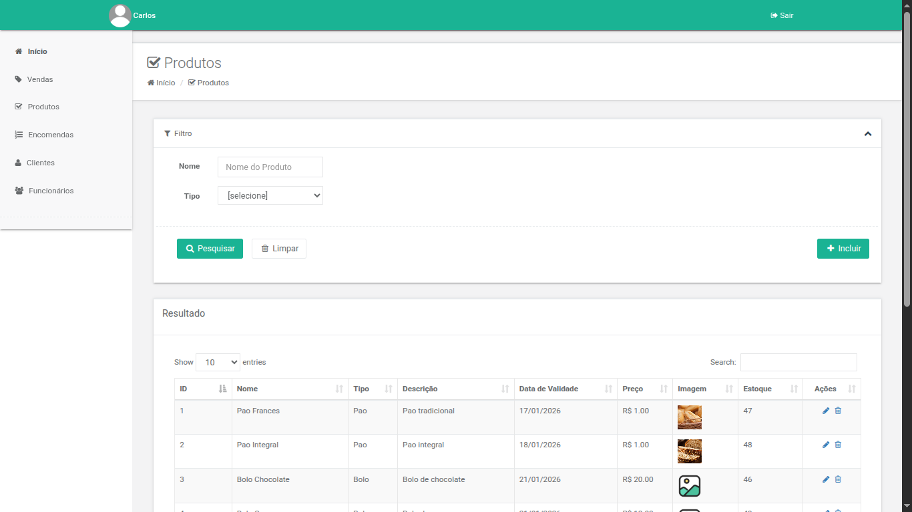
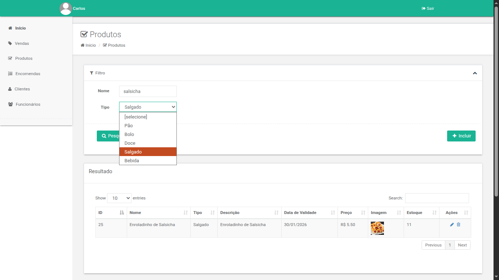
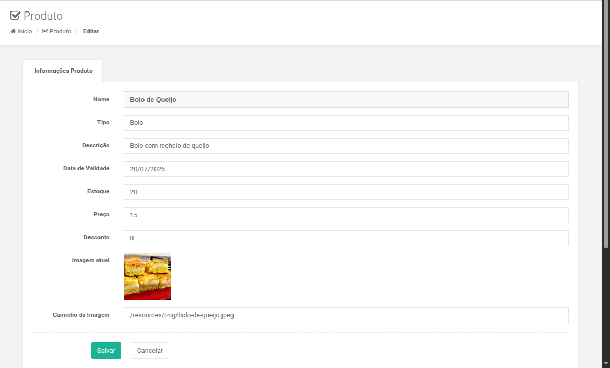
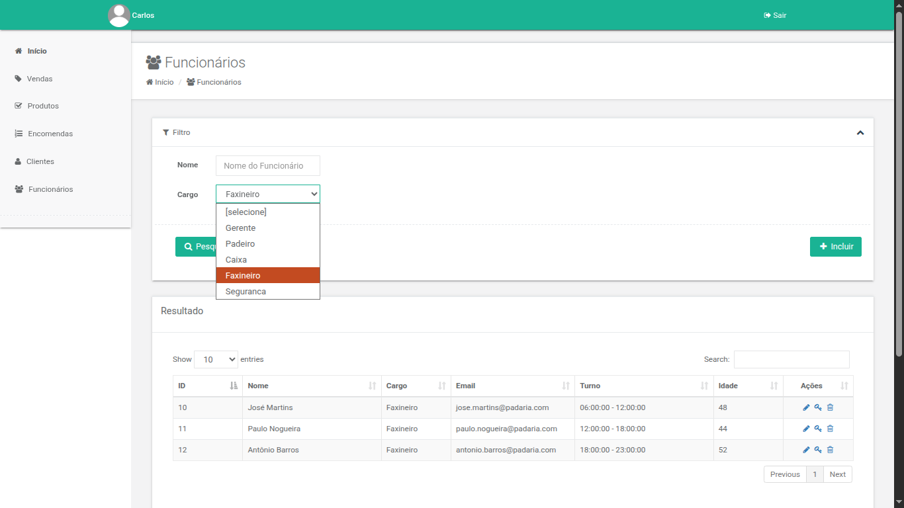
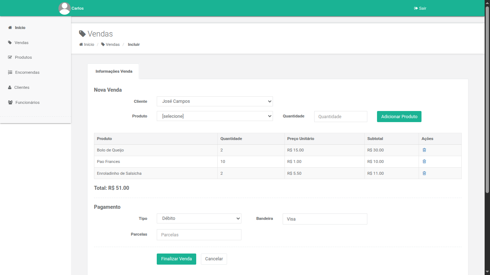
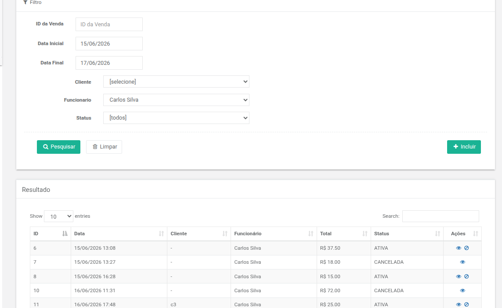
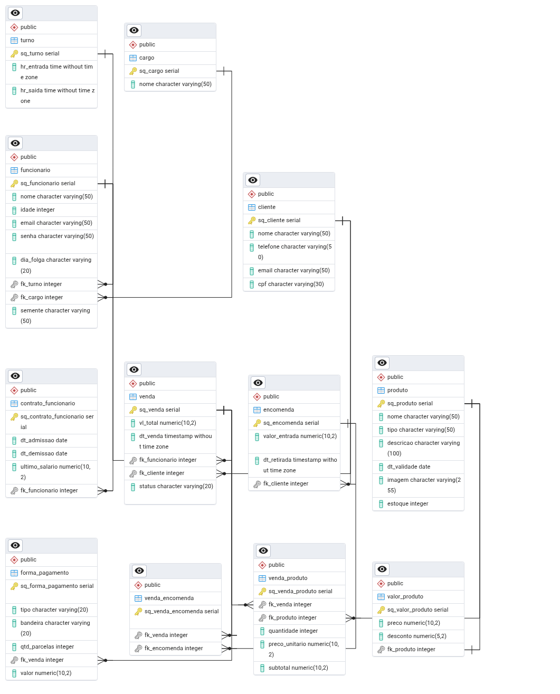

# PadariaWeb

Sistema web para gerenciamento de padarias desenvolvido em Java.

## Funcionalidades

- Cadastro de produtos
- Cadastro de clientes
- Cadastro de funcionários
- Controle de vendas
- Controle de encomendas
- Pesquisa e filtros
- Paginação de resultados
- Autenticação e controle de acesso

## Tecnologias utilizadas

- Java EE
- JSF
- PrimeFaces
- JPA / Hibernate
- PostgreSQL
- Maven
- Tomcat
- Git
- Linux Ubuntu

## Arquitetura

O sistema segue o padrão MVC (Model-View-Controller), utilizando JPA/Hibernate para persistência de dados e JSF/PrimeFaces para a camada de apresentação.

## Banco de Dados

Banco de dados PostgreSQL com modelagem relacional para gerenciamento das entidades do sistema.

## Como executar

1. Clonar o repositório
2. Configurar PostgreSQL
3. Executar os scripts SQL
4. Configurar o Tomcat
5. Executar o projeto

## Autor

Samuel de Sousa Rodrigues

# Screenshots

## Gestão de Produtos

### Listagem de Produtos

### Pesquisa de Produtos

### Cadastro de Produtos

---

## Gestão de Funcionários

---

## Gestão de Vendas

### Inclusão de Venda

### Pesquisa e Listagem de Vendas

---

<h2>Modelo do Banco de Dados</h2>

    

